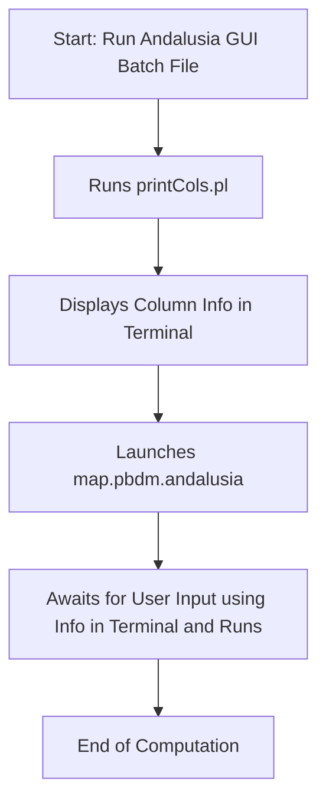
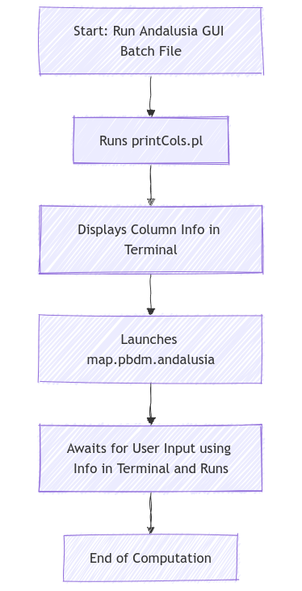

# README: Invoking PBDM Scripts in GRASS GIS 6

This README provides step-by-step instructions for invoking the physiologically based demographic modeling (PBDM) scripts. The process is outlined for the old method in GRASS GIS 6.

## Overview

PBDM scripts perform demographic modeling using GRASS GIS 6.

---

## Old Way: GRASS GIS 6 based version

### Script Location

- **Batch File**: `casas_gis_old/casas/Andalusia GUI.bat`
- **Main Script**: `casas_gis_old/casas/grass_scripts/map.pbdm.andalusia`
- **Utility Script**: `casas_gis_old/PerlScripts/printCols.pl`

### Workflow

**1. Run the Batch File**

- Double-click `Andalusia GUI.bat`.
- This script then calls the Perl script `printCols.pl` prints column numbers and names to the DOS command prompt:
  ```bash
  perl %HOME%\PerlScripts\printCols.pl "%HOME%"
  ```
  - It expects the data textfiles to be scanned in `%HOME%\outfiles\`.
- Then execution pauses, leaving the column data visible for reference.

**2. Launch GRASS GIS Script**

- The `Andalusia GUI.bat` batch file next launches the main GRASS GIS script:
  ```bash
  map.pbdm.andalusia
  ```
- Users enter the required column numbers from the previous terminal output into the GUI.

**3. GRASS GIS Script Execution**

- The user can now "Run" (button) the analysis.
- Eventually, the batch file halts, ensuring users can view the output before proceeding.

### Flowchart: Andalusia Example

<!--
# render in https://mermaid.live

-->



```
