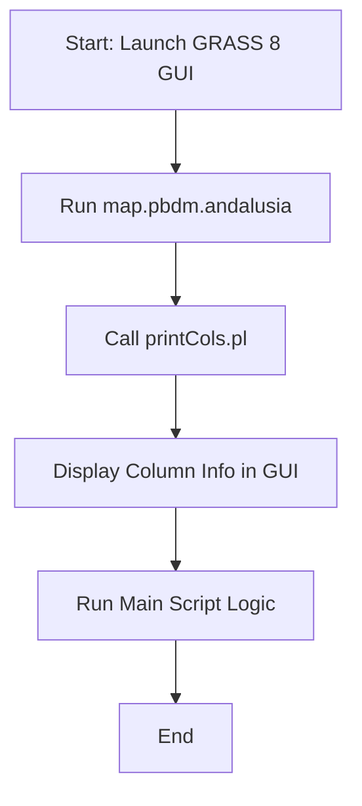
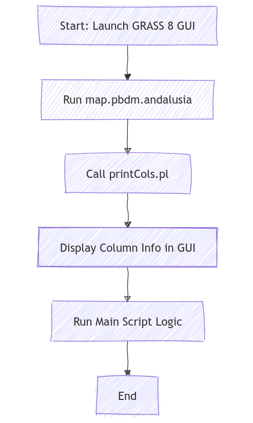

# README: Invoking PBDM Scripts in GRASS GIS 8

This README provides step-by-step instructions for invoking the physiologically based demographic modeling (PBDM) scripts. The process is outlined for the updated approach in GRASS GIS 8.

## Overview

PBDM scripts perform demographic modeling using GRASS GIS. With the update to GRASS GIS 8, invoking the scripts has changed significantly to improve cross-platform compatibility and usability.

---

## New Way: GRASS GIS 8 (work in progress)

### Dataset

GRASS GIS database for CASAS-PBDM (www.casasglobal.org) geospatial mapping and analysis:

- download `casas_gis_grass8data.zip` at <https://doi.org/10.5281/zenodo.14179438>

### Script Location

- **Batch File**: `casas_gis_old/casas/Andalusia GUI.sh` (TODO: find better name)
- **Main Script**: `casas_gis_old/casas/grass_scripts/map.pbdm.andalusia` (updated for GRASS GIS 8.4+)
- **Utility Script**: `casas_gis_old/PerlScripts/printCols.pl`

### Workflow

**1. Integrated Column Display**

- The Perl script `printCols.pl` is integrated directly into the GRASS GIS script.
- Column information is displayed in the standard output of the GRASS GUI or terminal.

**2. Unified GUI for CASAS Scripts**

- A centralized GUI calls all CASAS GIS scripts and prints output to a dedicated window for user reference.

### Flowchart

<!--
# render in https://mermaid.live

-->



---

## Key Differences

| Feature                      | GRASS GIS 6 version       | GRASS GIS 8 version  |
| ---------------------------- | ------------------------- | -------------------- |
| Column Info Display          | DOS Command Prompt        | GRASS GUI/Terminal   |
| Script Invocation            | Batch File + GRASS Script | Unified GRASS Script |
| Cross-Platform Compatibility | Limited                   | Enhanced             |
```
