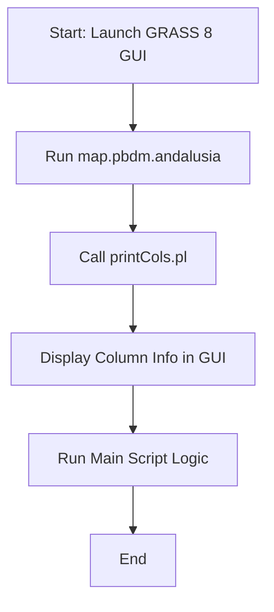

# README: Invoking PBDM GIS Scripts in GRASS GIS 8

This README provides background information and step-by-step instructions
for invoking the physiologically based demographic modeling (PBDM) scripts
developed by CASAS. The process outlined below is intended for the approach
updated to GRASS GIS 8.

## Overview

CASAS-PBDM scripts perform demographic modeling using GRASS GIS. With
the update to GRASS GIS 8, invoking the scripts has significantly changed
to improve cross-platform compatibility and usability.

## Background information

CASAS-PBDM is a general tritrophic system modeling library that uses the
physiologically based demographic modeling (PBDM) approach and unifies
existing CASAS-PBDM system models.

CASAS-PBDM implements the physiologically based demographic modeling (PBDM)
approach of Gutierrez (1996), and generalizes from an existing set of
CASAS-PBDM system models coded in Pascal that have been developed for decades
in the Laboratory of Andrew Paul Gutierrez at University of California,
Berkeley and by international collaborators for published PBDM system
analyses and are now owned by CASAS Global (<https://www.casasglobal.org/>).

In terms of implementation, the main building block of the CASAS-PBDM general
population modeling library is be the concept of functional population
(see Gutierrez 1996).

Reference:

Gutierrez, A.P., 1996. Applied population ecology: A supply-demand approach.
John Wiley and Sons, New York, ISBN: 978-0-471-13586-9.

For reference: The original source code version ("`t_0`", developed for GRASS GIS 6) is found at
<https://github.com/casasglobal-org/casas-gis/tree/8762935cfb28c16b1b3e157bad1be37942e6ca2e/casas_gis_old>.

## CASAS-PBDM geospatial dataset

The GRASS GIS database for CASAS-PBDM geospatial mapping and analysis:

One needs to download `casas_gis_grass8data.zip` at <https://doi.org/10.5281/zenodo.13254494> and unpack into e.g. `grassdata/`

Available datasets therein:

```
AEA_Hawaii/
AEA_Med/
AEA_Med_forGrape/
AEA_US/
AEA_US_mex_central_america/
africa_aea/
California_AEA/
CFSR/
GaussBoagaOvest/
laea_andalusia/
laea_colombia/
LAEA_Europe/
LAEA_India/
latlong/
latlong2/
latlong3/
latlong_for_casas/
latlong_medgold/
```

## CASAS-PBDM modeling input data

The PBDM simulation files are to be stored in `$HOME/CASAS_DATA/infiles/`

As an example for a modeling input file, use
[Olive_30set19_Avg.txt](https://github.com/casasglobal-org/casas-gis/blob/main/casas_gis_old/infiles/Olive_30set19_Avg.txt).

## Script organization

- **GUI File**: `casas_gis_old/casas/Andalusia GUI.sh`
- **Main Script**: `casas_gis_old/casas/grass_scripts/map.pbdm.andalusia`
- **Utility Scripts**: `casas_gis_old/PerlScripts/printCols.pl`, ...

## Workflow

### Text file parsing

The `convert.pl` script will read data from:

```bash
$HOME/CASAS_DATA/outfiles/
```

The only `*.txt` files in this directory should be the files resulting
from PBDM simulation (those for which a numbered list of column names
is printed when the bash script starts).

Cleaning up the `models_temp/` directory is fine as that is a temporary
directory and there may be leftovers from previous GIS runs.

**Integrated Column Display**

Note: the Perl script `printCols.pl` is integrated directly into the
GRASS GIS script. It prints the column information from `varList.txt`
([example](https://github.com/casasglobal-org/casas-gis/blob/0803f62d9f2da0af7bd14cce1febbdb5b46dc0c6/casas_gis_old/outfiles/varList.txt))
to standard output in the GRASS GUI or terminal.

```bash
cd $HOME/software/casas-gis/casas_gis_old/

# read file outfiles/varList.txt (example file)
perl printCols.pl .
```

Basically, `printCols.pl` only generates a harmless text file including
information about the input CSV tab-separated file.

Hint: one of the following scripts generates `varList.txt`:

```bash
ls casas_gis_old/casas/grass_scripts/
africa EurMedGrape india italia LibyaTunisia map.pbdm.andalusia map.pbdm.colombia MedPresentClimate usa
```

### Flowchart

(render next in <https://mermaid.live>)




### Key Differences among the script versions

| Feature                      | GRASS GIS 6 version       | GRASS GIS 8 version  |
| ---------------------------- | ------------------------- | -------------------- |
| Column Info Display          | DOS Command Prompt        | GRASS GUI/Terminal   |
| Script Invocation            | Batch File + GRASS Script | Unified GRASS Script |
| Cross-Platform Compatibility | Limited                   | Enhanced             |

### Data directory initialization

Major change from the previous script version developed for GRASS GIS 6,
this updated version for GRASS GIS 8 has disentangled the software and
data directories.

Hence, before starting with any related processing, the CASAS data
directory needs to be initialized, i.e. populated with data (see related
comments in <https://github.com/casasglobal-org/casas-gis/pull/141>).

```bash
# assumption: the data directory is: $HOME/CASAS_DATA/

# clean from previous run
rm -rf $HOME/CASAS_DATA/* ;

# populate data directory with appropriate datasets
mkdir -p $HOME/CASAS_DATA/outfiles/
# use sample PBDM modelling txt files
cp -p $HOME/software/casas-gis/casas_gis_old/*.txt $HOME/CASAS_DATA/outfiles/
```

The text files in `outfiles/*.txt` are output files from a PBDM simulation.
Here the relevant files, resulting from PDBM modelling, are:

```bash
tree $HOME/CASAS_DATA/outfiles/
/home/mneteler/CASAS_DATA/outfiles/
├── inputPar.txt
├── outfiles
├── varList.txt
└── year1.txt
```

## GUI usage

**Unified GUI for CASAS Scripts**

A centralized GUI calls all CASAS GIS scripts and prints output to a dedicated
window for user reference.

```bash
cd $HOME/software/casas-gis/
bash "casas_gis_old/casas/Andalusia GUI.sh"
```

... TODO - TBD add more.

## Command line usage

Note: the `$HOME/software/casas-gis/casas_gis_old/scripts/batch_XXXXX.sh` scripts
are not test scripts but just a way to run a bunch of multiple mapping cycles
(i.e., CASAS GRASS scripts like `africa`) without using the GUI and with the ability
to select which variable to map. The batch files do not exist for all scripts.

### Africa use case (no batch)

```bash
grass84 $HOME/data/casas/grass8data_casas/latlong/luigi/ --exec $HOME/software/casas-gis/casas_gis_old/casas/grass_scripts/africa
```

### Olive Andalusia usage (batch)

```bash
# this will call `map.pbdm.andalusia` internally:
grass84 $HOME/data/casas/grass8data_casas/laea_andalusia/medgold/ --exec $HOME/software/casas-gis/casas_gis_old/scripts/batch_olive_andalusia.sh
```

### Olive Protheus usage (batch)

(correct dataset?)

```bash
grass84 $HOME/data/casas/grass8data_casas/latlong/luigi/ --exec $HOME/software/casas-gis/casas_gis_old/scripts/batch_OliveProtheus.sh
```

### Olive Protheus Bioeconomics (batch)

```bash
grass84 $HOME/data/casas/grass8data_casas/latlong/luigi/ --exec $HOME/software/casas-gis/casas_gis_old/scripts/batch_OliveProtheus_Bioeconomics.sh
```

### Olive Protheus Bioeconomics PNAS (batch)

```bash
grass84 $HOME/data/casas/grass8data_casas/latlong/luigi/ --exec $HOME/software/casas-gis/casas_gis_old/scripts/batch_OliveProtheus_Bioeconomics_PNAS.sh
```

### Olive Protheus BlackWhite (batch)

```bash
grass84 $HOME/data/casas/grass8data_casas/latlong/luigi/ --exec $HOME/software/casas-gis/casas_gis_old/scripts/batch_OliveProtheus_BlackWhite.sh
```

### Olive Protheus mapsOfChange (batch)

```bash
grass84 $HOME/data/casas/grass8data_casas/latlong/luigi/ --exec $HOME/software/casas-gis/casas_gis_old/scripts/batch_OliveProtheus_mapsOfChange.sh
```

### Coffee Colombia usage

```bash
grass84 $HOME/data/casas/grass8data_casas/laea_colombia/medgold/ --exec $HOME/software/casas-gis/casas_gis_old/scripts/batch_coffee_colombia.sh
```

### India cotton (batch)

```bash
grass84 $HOME/data/casas/grass8data_casas/LAEA_India/luigi/ --exec $HOME/software/casas-gis/casas_gis_old/scripts/batch_india_cotton.sh
```

### Libya-Tunisia screwworm (batch)

```bash
grass84 $HOME/data/casas/grass8data_casas/AEA_Med/luigi/ --exec $HOME/software/casas-gis/casas_gis_old/scripts/batch_LibyaTunisia_screwworm.sh
```

### Libya-Tunisia screwworm sw_majorRev (batch)

```bash
grass84 $HOME/data/casas/grass8data_casas/AEA_Med/luigi/ --exec $HOME/software/casas-gis/casas_gis_old/scripts/batch_LibyaTunisia_sw_majorRev.sh
```

### OliveProtheus (batch)

```bash
grass84 $HOME/data/casas/grass8data_casas/AEA_Med/luigi/ --exec $HOME/software/casas-gis/casas_gis_old/scripts/batch_OliveProtheus.sh
```

### swd EU (EurMedGrape) (batch)

```bash
grass84 $HOME/data/casas/grass8data_casas/AEA_Med/luigi/ --exec $HOME/software/casas-gis/casas_gis_old/scripts/batch_swd_EU.sh
```

### USA olive Hawaii (batch)

data: AEA_Hawaii

```bash
grass84 $HOME/data/casas/grass8data_casas/AEA_Hawaii/luigi/ --exec $HOME/software/casas-gis/casas_gis_old/scripts/batch_USA_olive.sh
```

### USA olive mex_central_america (batch)

data: AEA_US_mex_central_america

```bash
grass84 $HOME/data/casas/grass8data_casas/AEA_US_mex_central_america/luigi/ --exec $HOME/software/casas-gis/casas_gis_old/scripts/batch_USA_olive.sh
```

### USA screwworm Hawaii (batch)

data: AEA_Hawaii

```bash
grass84 $HOME/data/casas/grass8data_casas/AEA_Hawaii/luigi/ --exec $HOME/software/casas-gis/casas_gis_old/scripts/batch_USA_screwworm.sh
```

### USA screwworm mex_central_america (batch)

data: AEA_US_mex_central_america

```bash
grass84 $HOME/data/casas/grass8data_casas/AEA_US_mex_central_america/luigi/ --exec $HOME/software/casas-gis/casas_gis_old/scripts/batch_USA_screwworm.sh
```
